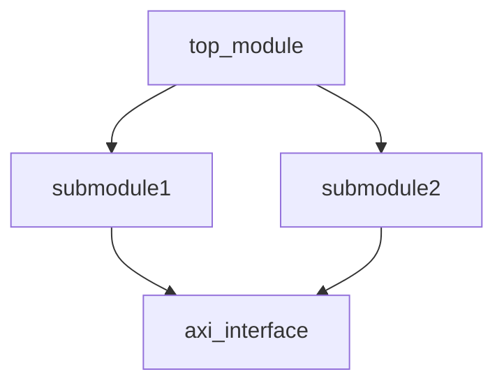

# 文档规范

## 目的

定义芯片设计项目的文档规范，确保设计可理解、可维护、可追溯。

## 文档层次

### 1. 项目级文档

- **项目概述**：项目目标、范围、规格摘要
- **架构文档**：整体架构、模块划分、时钟域、复位域
- **接口文档**：模块间接口、片外接口、协议定义
- **存储器映射**：寄存器地址空间分配表

### 2. 模块级文档

每个模块必须包含：
- 模块功能描述
- 输入输出端口定义
- 主要内部数据流
- 时钟和复位要求
- 配置参数说明

### 3. 实现文档

- **约束文档**：时序约束说明
- **Floorplan 文档**：电源规划、模块摆放
- **DFT 文档**：扫描链配置、测试点说明
- **功能安全文档**：安全需求、安全机制、FMEDA

### 4. 验证文档

- **验证计划**：验证范围、功能点、覆盖率目标
- **验证结果**：测试结果、覆盖率统计
- **问题记录**：发现的问题、根因分析、修复情况

## 文档格式

- 使用 Markdown 格式，便于版本控制
- 使用 Mermaid 绘制框图、状态图、流程图
- 图片使用 SVG 格式，便于版本控制
- 表格使用 Markdown 表格

示例框图：

## 版本控制

- 所有文档纳入版本控制
- 重要修改保留修改历史
- 修改时更新版本号
- 修改日志记录修改内容和原因

## 寄存器文档

使用标准化格式描述寄存器：

| 地址偏移 | 名称 | 读/写 | 复位值 | 位域说明 |
|----------|------|-------|--------|----------|
| 0x0000   | CTRL | WO | 0x0000 | bit 0: enable, bit 1: reset |
| 0x0004   | STATUS | RO | 0x0001 | bit 0: busy, bit 1: error |

## 接口时序文档

- 提供时序图（可以手绘或使用绘图工具）
- 描述建立时间和保持时间要求
- 描述延迟要求
- 描述握手协议

## 更新要求

- 代码修改必须同步更新文档
- 每次提交检查文档是否需要更新
- 架构修改必须先更新文档再改代码
- 文档和代码必须一致，不能文档过期

## 检查清单

- [ ] 项目概述已编写
- [ ] 架构文档已完成
- [ ] 所有模块都有模块文档
- [ ] 存储器映射完整
- [ ] 验证计划和验证结果完整
- [ ] 所有修改都已更新文档

## 工具推荐

- **文档编写**：VS Code + Markdown
- **绘图**：Mermaid, draw.io
- **文档生成**：MkDocs, Sphinx
- **版本控制**：Git

## 代理使用

文档编写完成后，可以使用 **doc-updater** 代理检查完整性。
