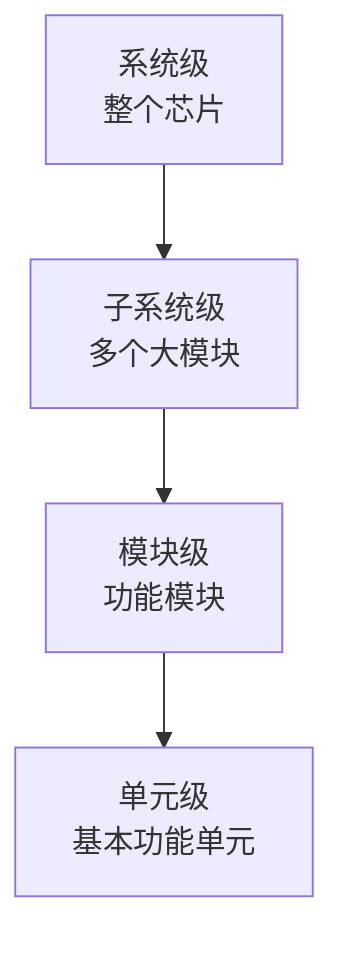

# 芯片架构设计技能

当用户需要进行芯片架构设计时，启用此技能。此技能提供芯片架构设计的完整指导，从需求定义到模块划分，遵循工业界最佳实践。

## When to Activate

- 新项目启动，需要定义整体芯片架构
- 项目新增功能模块，需要定义接口和交互
- 对现有架构进行重构优化
- 需要评估不同架构方案的优缺点
- 需要进行架构权衡分析（面积vs性能vs功耗）

## 需求收集和分析

在开始设计之前，必须收集并明确所有需求：

### 需求清单

| 需求类别 | 需要明确的内容 |
|----------|----------------|
| **功能需求** | 需要实现哪些功能？features list |
| **性能需求** | 目标频率？峰值吞吐量？平均延迟？最坏延迟？ |
| **面积预算** | 总门数预算？存储器容量预算？ |
| **功耗预算** | 动态功耗上限？静态功耗上限？ |
| **接口需求** | 片上总线接口？片外IO接口？协议要求？ |
| **安全需求** | 功能安全 ASIL 等级？信息安全要求？ |
| **测试需求** | DFT 覆盖率要求？测试时间限制？ |

### 需求排序

不是所有需求都同等重要：
1. **强制性需求**：必须满足，否则项目失败
2. **期望需求**：最好满足，不满足项目仍然可以接受
3. **可选需求**：有空就做，没有也没关系

始终优先满足强制性需求。

## 自上而下分解

### 分解层次



### 分解原则

**✅ 好的分解：**
- 每个模块只有一个职责（单一职责原则）
- 模块之间依赖少，松耦合
- 大小均匀，没有过大模块（>100k 门建议拆分）
- 接口清晰，数量少

**❌ 不好的分解：**
- 一个模块做太多事情
- 模块之间循环依赖
- 一个模块几十万门，无法多人并行开发
- 接口混乱，很多隐藏连接

示例：一个 PCIe SSD 控制器分解：

```
PCIe SSD Controller
├── PCIe PHY            # PCIe 物理层
├── PCIe MAC            # PCIe 数据链路层
├── NVMe Controller     # NVMe 协议处理
├── Flash Controller    # NAND Flash 控制
├── ECC Engine          # 错误纠正
├── Wear Leveling       # 损耗均衡
├── DMA Engine          # DMA 数据搬运
└── Interrupt Generator # 中断产生
```

每个模块职责清晰，接口清晰，可以并行开发。

## 接口设计原则

### 接口协议选择

| 协议 | 适用场景 | 优点 | 缺点 |
|------|----------|------|------|
| **AXI4** | 高带宽存储器映射接口 | 乱序访问，QoS，区域保护 | 协议复杂，面积大 |
| **AXI4-Lite** | 寄存器配置接口 | 简单，轻量级 | 低带宽只适合配置 |
| **AXI4-Stream** | 数据流接口 | 完美适合视频/网络数据流 | 不适合随机访问 |
| **AHB** | 中带宽总线 | 简单，面积小 | 不支持乱序 |
| **APB** | 低带宽外设 | 非常简单，面积很小 | 低带宽 |

**推荐**：现在大多数 SoC 使用 AXI 系列协议。

### 握手协议设计

**✅ 好的设计：ready/valid 双向握手**

```
 发送方:
   valid 表示数据有效
   当 ready 为高时，才能发送下一个

 接收方:
   ready 表示可以接收数据
   可以要求发送方等待
```

波形：
```
clock:  ┌─┐ ┌─┐ ┌─┐ ┌─┐ ┌─┐
        ┘ └─┘ └─┘ └─┘ └─┘ └─
valid:  ─────┐           ┌──────
             └───────────┘
ready:  ─┐           ┌─────────
           └───────────┘
data:   ----D0----------D1-------
```

**✅ 正确示例（SystemVerilog）：**

```systemverilog
// 发送方
always_comb begin
  o_valid = buffer_not_empty;
  w_ready = i_valid && o_ready;
end

// 接收方
always_comb begin
  o_ready = can_accept;
end
```

**❌ 不好的设计：**
- 没有握手机制，发送方不管接收方是否能接收一直发
- 单向握手，只有 valid 没有 ready

### 错误处理设计

接口必须定义清楚错误处理：
- 什么时候会产生错误？
- 错误怎么报告？
- 错误发生后怎么恢复？
- 还是直接进入安全状态？

**示例：**
- 读访问地址不对齐 -> 返回错误响应，保持系统运行
- 超时 -> 产生中断，软件处理
- 致命错误 -> 触发复位，进入安全状态

### 跨时钟域接口

必须明确：
- 哪个信号跨哪个时钟域？
- 使用什么同步方法？（两级同步/异步FIFO/握手）
- 谁负责实现同步？（发起方还是接收方？）

## 时钟和复位规划

### 时钟域划分原则

✅ **推荐：**
- 不同频率放在不同时钟域
- 不同来源的时钟放在不同时钟域
- 关断时钟的模块放在独立时钟域
- 异步接口两边放在不同时钟域

❌ **避免：**
- 多个不同频率的逻辑混在同一个时钟域
- 门控太多大扇出时钟（影响时钟树质量）

### 频率选择技巧

- 满足性能需求即可，不要过度追求高频率
- 高频率意味着更高功耗和更难时序收敛
- 并行处理+低频率比串行+高频率通常更好（PPA更优）

### 复位策略选择

**异步复位：**
- ✅ 优点：不需要时钟就能复位，适合没有时钟的模块
- ✅ 优点：异步复位可以在任何时候复位
- ❌ 缺点：复位释放容易有毛刺，需要同步释放
- ❌ 缺点：容易影响STA（静态时序分析）

**同步复位：**
- ✅ 优点：复位和时钟同步，STA友好
- ✅ 优点：没有毛刺问题
- ❌ 缺点：需要时钟才能复位，没有时钟不能复位
- ❌ 缺点：面积略大

**项目级规则：**
> 在同一个项目中，保持一致！要么全异步复位，要么全同步复位，不要混合使用两种风格。

### 复位域划分

- 需要同时复位的模块放在同一个复位域
- 可以独立复位的模块放在独立复位域
- 安全相关逻辑通常有独立复位域（安全复位不影响功能复位）

## 存储器规划

### 容量估算

- 计算每个缓冲区需要多大容量
- 考虑数据宽度和深度
- 考虑两端速率差需要的弹性缓冲
- FIFO 深度公式：`深度 = 速率差 × 突发长度 × 安全系数(1.5)`

### 端口数量规划

- 单端口：面积小，不能同时读写，适合只读/只写
- 伪双端口：可以同时读写，面积适中，大多数情况选择这个
- 真双端口：可以同时读写同一地址，面积大，只在真正需要时用

### 可靠性

- 存储器用于存储关键数据 -> 需要 ECC
- 存储器用于存储非关键数据 -> 可以只用奇偶校验
- 只读存储器 -> 不需要纠错

## 电源规划

### 电源域划分

- 不同工作电压的模块放在不同电源域
- 可以独立关断的模块放在独立电源域
- 安全关键模块通常放在始终上电的电源域

### 低功耗设计要素

- 动态电源关断：不使用的时候关断整个电源域
- 时钟门控：关闭不使用的模块时钟
- 多电压：不同模块不同电压，关键模块较高电压，非关键较低电压
- 电源岛：整块芯片不同电源岛独立控制

### 电平转换器和隔离

- 不同电压域之间的信号必须用电平转换器
- 关断电源域的输出必须插入隔离单元
- 保持寄存器需要在始终上电域

## DFT 规划

- 扫描链：长度平衡，方便测试
- 存储器都需要 BIST（内置自测试）
- JTAG TAP 控制器必须有
- 难测试的节点插入测试点
- 测试压缩减少测试数据量和测试时间

## 架构评估

评估每个候选架构，选择最优：

| 评估指标 | 评估方法 | 评分（1-5） |
|----------|----------|-------------|
| **可验证性** | 是否容易搭建验证环境？是否容易观测内部状态？ | |
| **可实现性** | 是否满足面积时序预算？工艺是否能实现？ | |
| **可调试性** | 是否容易调试？是否有足够的观测点？ | |
| **可扩展性** | 是否方便未来功能扩展？ | |
| **功耗** | 是否满足功耗预算？有没有进一步优化空间？ | |
| **面积** | 是否满足面积预算？ | |
| **时序** | 能不能达到目标频率？有没有余量？ | |

### 决策

选择总分最高的方案，不要追求完美，满足所有强制性需求就是可接受方案。

## 文档交付物

架构设计完成后，必须输出：

- [ ] 架构设计文档（整体描述，设计决策理由）
- [ ] 模块接口规格（每个模块的功能、输入、输出、时序）
- [ ] 存储器映射表（地址空间分配，每个寄存器含义）
- [ ] 时钟复位规划图（时钟域、复位域划分）
- [ ] 顶层框图（Mermaid 或图形格式）

## 检查清单

架构设计交付前检查：

- [ ] 所有强制性需求都已满足
- [ ] 模块划分清晰，单一职责
- [ ] 所有接口定义清楚，协议明确
- [ ] 时钟域划分正确，跨时钟域处理明确
- [ ] 复位策略一致，复位域划分合理
- [ ] 存储器容量满足需求，可靠性满足要求
- [ ] 电源规划满足低功耗需求
- [ ] DFT 规划满足覆盖率要求
- [ ] 面积时序功耗预算都满足
- [ ] 文档完整，所有决策都记录理由

## 反模式（要避免）

❌ **过度设计**：现在就添加十年后才需要的功能，增加当前复杂度
❌ **设计不足**：没有考虑未来扩展，一年后就要重构
❌ **模糊接口**：接口定义不清晰，集成时候才发现问题
❌ **忽略验证**：架构不容易验证，后期验证找不到bug
❌ **忽略后端**：架构布局完全不考虑后端实现，导致时序无法收敛

## 代理协作

- 架构定义完成后，使用 `rtl-designer` 代理实现 RTL
- 使用 `verification-engineer` 代理开发验证平台
- 如果有功能安全需求，使用 `functional-safety-engineer` 代理进行安全分析
